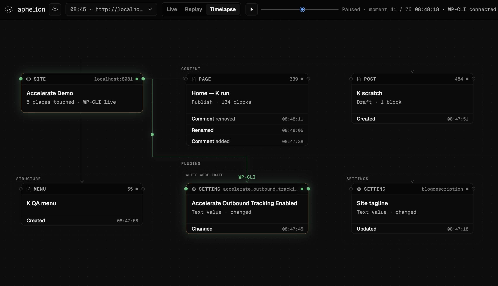

# Aphelion

**The local flight recorder for AI agents working on WordPress.**

[](https://www.npmjs.com/package/aphelion)
[](https://www.npmjs.com/package/aphelion)
[](https://github.com/humanmade/aphelion/actions/workflows/ci.yml)
[](./LICENSE)
[](https://socket.dev/npm/package/aphelion)



An agent will tell you it updated a page, the filesystem will show you a diff, and
WordPress will report a save — three fragments of one story, usually scattered across
terminals and logs. Aphelion records them as a single append-only trail on your machine
and renders that one record three ways: a live map while the agent works, a replay you
can scrub when something needs explaining, and a timelapse worth sharing when it goes
well. While the work happens it behaves like observability; afterward it holds up as an
audit trail — accountability for agentic workflows with nothing leaving your machine.

The board reads as a map rather than a log. Pages, settings, plugins, menus, and users
are durable places grouped into WordPress-shaped territories, and each change lands on
its place with light and motion within a second or two of happening. An agent's declared
intent appears as a provisional card until WordPress independently confirms it, which
keeps agreement quiet and makes divergence exactly the thing you notice. Any recorded
session scrubs on the same stable map, deep-links to the moment
(`?session=…&mode=replay&seq=…`), and can be rendered into a timelapse after the fact —
nobody had to press record.

What makes the record trustworthy:

- **One append-only JSONL trail per session**, flushed on every event, file mode `0600`,
  with optional SHA-256 hash chaining (`--integrity`) for tamper evidence. Every surface
  is a projection of this file; no view owns a second history.
- **Local by construction.** Binds to `127.0.0.1`, no accounts, no telemetry — the
  evidence never leaves your machine, and it is never deleted automatically.
- **Agent governance without injection.** `aphelion mcp -- <server>` wraps any MCP
  server and records what agents *declare*, byte-transparent to their traffic: tool
  names and argument keys, never values, content, or credentials.
- **WordPress-native depth**: block edits fold into their page, revisions into their
  post, plugin options into their plugin's territory, with owner-readable names
  throughout. Sessions close on idle, and the observer warns when its mu-plugin is
  stale rather than silently under-recording.
- **Zero runtime dependencies** on Node 20+.

## Quickstart

```sh
npm install --global aphelion
cd /path/to/your-project
aphelion --open
```

The command prints the local board URL and trail path. Keep it running while an agent works.
Project-local works too: `npm install --save-dev aphelion && npx aphelion --open`.

## Record once, render many

```text
agent hooks ─┐
repo watcher ├─> append-only trail ─> live board
WordPress ───┤                     ├─> replay
WP-CLI/MCP ──┘                     └─> timelapse
```

Every surface is a projection of one JSONL trail — no view owns a second history. The board
speaks three nouns: **places** (durable WordPress objects, the only things with a position),
**flows** (channels carrying an actor's work), and **changes** (timed claim-plus-confirmation
moments in a place's history). The full contract lives in
[the topology language](docs/topology-language.md); evidence stays structural — block and
attribute *names*, never content, option values, credentials, or Ability payloads.

## Add WordPress evidence

Repository observation needs no WordPress installation. Site context is progressive:

| Level | Install cost | What becomes visible |
| --- | --- | --- |
| Repo watcher and agent hooks | None | Files, declared actions, plan progress, presence |
| Generic MCP stdio tap — `aphelion mcp -- <server command...>` | None; wraps an existing local MCP server | MCP presence, tool-call names, structural argument keys, and declared completion without values or result bodies |
| Read-only WP-CLI sidecar | A local WP-CLI / Docker / SSH command | Runtime baseline, drift fingerprints, site identity |
| Audit mu-plugin | One PHP file in `wp-content/mu-plugins/` | WordPress hook effects: posts, blocks, settings, terms, menus, users, comments, plugins |
| Plugin adapter | Optional | Product semantics beside the raw effect; Accelerate included |

```sh
cp node_modules/aphelion/src/mu-plugin/aphelion-audit.php \
  /path/to/wordpress/wp-content/mu-plugins/aphelion-audit.php

aphelion \
  --site http://localhost:8081 \
  --audit-log /path/to/wordpress/wp-content/aphelion/audit.jsonl \
  --wp-command '["docker","exec","wordpress","wp","--allow-root","--path=/var/www/html"]' \
  --open
```

The mu-plugin has no settings screen and no remote transport (PHP 7.4+; WordPress-aware
features target 6.9+). Full channel, transport, redaction, and timing contract:
[WordPress observation surfaces](docs/observation-surfaces.md).

## Run automatically — opt in

The normal command stays foreground and explicit. For a workstation or long-lived local
stack, an OS user service can start Aphelion at login — deliberately not enabled by default:
background observation should be a conscious choice. See
[Running Aphelion in the background](docs/background-service.md) for `launchd`/`systemd
--user` setup, health checks, and removal.

## CLI

| Command | When to use it |
| --- | --- |
| `aphelion [target]` | Observe a repository; defaults to the current directory. |
| `aphelion serve [target]` | The explicit form of the default command. |
| `aphelion sessions [target]` | List recorded sessions and their trail paths. |
| `aphelion timelapse <trail.jsonl>` | Render a standalone timelapse from an existing trail. |
| `aphelion hook` | Relay one agent-hook payload from stdin to the local daemon. |
| `aphelion mcp -- <server command...>` | Transparently observe an existing MCP stdio server. |

| Option | Meaning |
| --- | --- |
| `--open` | Open the loopback board after startup. |
| `--port <number>` | Preferred loopback port; falls forward if occupied. |
| `--idle-timeout <minutes>` | End a session after this much non-heartbeat inactivity (default 30). |
| `--site <url>` | Record a site target instead of a repository target. |
| `--audit-log <path>` | Tail the site-local audit mu-plugin JSONL. |
| `--debug-log <path>` | Tail a WordPress debug log with capture-boundary redaction. |
| `--wp-command <json>` | Read-only WP-CLI baseline from a JSON string array; no shell evaluation. |
| `--integrity` | Add SHA-256 `prev` links to new trail events. |
| `--no-watch` | Disable repository filesystem watching. |
| `--output <path>` | Timelapse `.html` or `.mp4` output path. |

Agent hooks pipe straight in — `printf '%s\n' "$AGENT_HOOK_JSON" | aphelion hook` — and MCP
calls stay declared requests, related to observed WordPress effects by request ID without
ever merging the records.

## Library

Aphelion is also a typed, zero-dependency ESM library:

```js
import { createTrailWriter, projectEvents, renderTimelapse, startDaemon } from 'aphelion'
```

The package exports the trail reader/writer, reducer, replay index, daemon, sidecar,
WordPress scanner, Accelerate adapter, and timelapse renderer, with type declarations.

## Trail ownership and privacy

The trail is the audit record: append-only, owned by you, and durable enough to answer
"what did the agent actually do" months after the session — replay is the forensic view
of the same file the live board projected.

| Property | Contract |
| --- | --- |
| Project trails | `<repo>/.aphelion/trail/<session>.jsonl` |
| Site trails | `~/.aphelion/trails/<site-slug>/<session>.jsonl` |
| File mode / flush | `0600`, flushed every event |
| Retention | Never deleted automatically |
| Network | Board and ingest bind to `127.0.0.1` |
| Telemetry / accounts | None |

Trails can still contain local paths, object titles, actor names, and action summaries —
treat them as operational records and review before sharing. See [Security](SECURITY.md).

## Documentation

[Documentation index](docs/README.md) · [Topology language](docs/topology-language.md) ·
[Observation surfaces](docs/observation-surfaces.md) · [Trail format](docs/trail-format.md) ·
[Background service](docs/background-service.md) · [Releasing](RELEASING.md) ·
[Changelog](CHANGELOG.md)

## Development

```sh
npm install
npm run verify
```

The verification gate builds the board, checks JS and PHP syntax, validates docs, runs the
unit and desktop/mobile browser suites, audits package exports, and installs the dry-run
tarball into a blank consumer.

Aphelion adapts the declared-versus-observed model from
[sodiumsun/agenttrail](https://github.com/sodiumsun/agenttrail) (MIT, vendored at `41454d4`);
substantially adapted files retain provenance comments.

## License

MIT. See [LICENSE](LICENSE).
